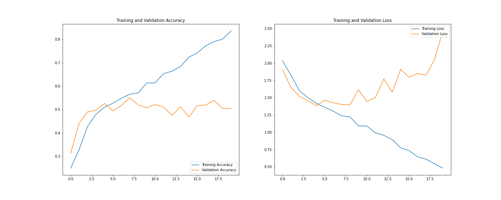

# Project Name
> Outline a brief description of your project.

> Table of Contents

- [General Information](#general-information)
- [Conclusions](#conclusions)
  - [Initial Model - without any preprocessing](#initial-model---without-any-preprocessing)
  - [Model 2 - data augmentation](#model-2---data-augmentation)
  - [Model 3 - Dropout layer](#model-3---dropout-layer)
  - [Model 4 - Class rebalancing](#model-4---class-rebalancing)
- [Tech Stack](#tech-stack)
- [Acknowledgements](#acknowledgements)
- [Contact](#contact)

<!-- You can include any other section that is pertinent to your problem -->

## General Information
To build a CNN based model which can accurately detect melanoma. Melanoma is a type of cancer that can be deadly if not detected early. It accounts for 75% of skin cancer deaths. A solution that can evaluate images and alert dermatologists about the presence of melanoma has the potential to reduce a lot of manual effort needed in diagnosis.

<!-- You don't have to answer all the questions - just the ones relevant to your project. -->

## Conclusions

Following are the conclusions from different models tried and experimented on the dataset:

### Initial Model - without any preprocessing

 - Model is **overfitting** and this can be observed from
   1. the huge gap between accuracies of train and validation sets
   2. training loss going towards zero or nullifying but validation loss keeps increasing inversely
  

### Model 2 - data augmentation
  

 - *Model is not overfitting but the accuracy has dropped*
 - *model validation curve in both accuracy and loss plot is fluctuating*
  

### Model 3 - Dropout layer

- *Model is not overfitting but the accuracy has dropped and compared to data augmentation model accuracy and loss curves are aligned*
  

### Model 4 - Class rebalancing

We can see train dataset is imbalanced and 
- class seborrheic keratosis has lowest samples i.e., 58
- classes pigmented benign keratosis, melanoma, basal cell carcinom, nevus dominating the data in terms of proportion

- *after rebalancing with augmentor package, the accuracy has been increased*
- *there is no overfitting happening*
- *train vs validation curves are smoother and not highly fluctuating like earlier models*
  

| Model                                | Train/ Validation Accuracy | Train/validation Loss | Comments                                                                         |
| ------------------------------------ | -------------------------- | --------------------- | -------------------------------------------------------------------------------- |
| Initial Model                        | 82/51                      | 0.46/2.15             | Model is overfitting                                                             |
| Model with Data Augmentation         | 58/54                      | 1.13/1.33             | Accuracy is low, overfitting is controlled                                       |
| Model with Dropout                   | 56/52                      | 1.22/1.44             | no overfitting, but plot curves are not smooth and fluctuating and less accuracy |
| Model with Class rebalance + Dropout | 84/80                      | 0.4/0.8               | accuracy improved, no overfitting and curves are smoother                        |

## Tech Stack
- Python - v3.9.12
- tensorflow - v2.8.0
- keras - v2.8.0

*Please refer requirements.txt file, for other optional libraries installed for this CNN exploration*

## Acknowledgements
- Project is developed as per requirements of assignment.
- Tensorflow - [loading images and processing them](https://www.tensorflow.org/tutorials/load_data/images)
- Stackoverflow - [Generating class distribution dictionary](https://stackoverflow.com/questions/60876805/how-to-show-the-class-distribution-in-dataset-object-in-tensorflow#answer-60877708)

## Contact
Created by [@Vinay26k](https://github.com/vinay26k) - feel free to contact me!
